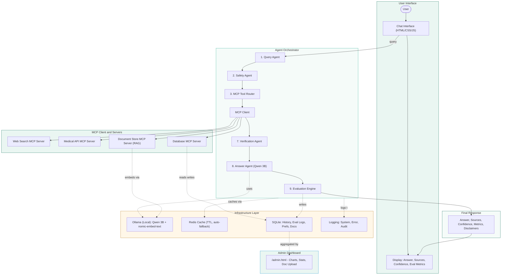
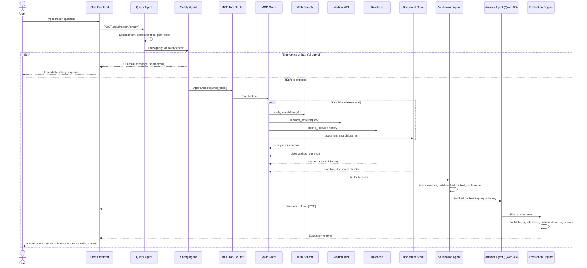

# agentic-mcp-healthcare
<div align="center">


# MediAegis AI

### Agentic AI Clinical Assistant with MCP Tool Orchestration

*Qwen 3B (local) · Model Context Protocol · Multi-Agent Verification & Evaluation*

[](https://www.python.org/)
[](https://fastapi.tiangolo.com/)
[](https://ollama.com/)
[](https://redis.io/)
[](https://www.sqlite.org/)
[](#-license)
[](#-contributing)

</div>

---

## 📌 Description

**MediAegis AI** is a reference implementation of an **agentic AI system built on the Model
Context Protocol (MCP)**, applied to general health information assistance. Instead of a
single prompt-to-LLM call, every user query passes through a pipeline of specialized
agents — query understanding, safety screening, tool routing, source verification, grounded
generation, and automated evaluation — before a response is returned.

The LLM (**Qwen 2.5 3B**) runs **entirely locally via [Ollama](https://ollama.com)** — no
data leaves the machine, and no API key is required to get a working system end to end.

> ⚠️ This is an educational/prototyping reference architecture. It is **not** a certified
> medical device and must not be used for real clinical decision-making, diagnosis, or
> emergency response. See [Limitations](#️-limitations).

---

## 🎯 Problem Statement

General-purpose chatbots answering health questions have three recurring failure modes:

1. **Ungrounded answers** — the model generates plausible-sounding but unverified medical
   claims (hallucination), with no visibility into *why* it said what it said.
2. **No safety layer** — emergency symptoms (chest pain, breathing difficulty) get treated
   like any other query, with no guardrail to redirect the user to real emergency services.
3. **No accountability** — there's no record of what sources were used, how confident the
   system was, or whether the answer was actually faithful to the retrieved context —
   making it impossible to audit or improve quality over time.

## 💡 Solution

MediAegis AI addresses this with an **agent-orchestrated pipeline** rather than a single
LLM call:

- A **Safety Agent** screens every query *before* any tool or model call, intercepting
  emergency/harmful patterns immediately.
- A **MCP Tool Router + MCP Client** pulls information from multiple sources in parallel —
  live web search, a medical reference API, institution-uploaded documents (RAG), and
  cached/previous answers — instead of relying on the model's parametric memory.
- A **Verification Agent** scores every source for trust/quality and builds a single
  verified context block, computing an overall confidence score.
- The **Answer Agent** (Qwen 3B) is instructed to answer *only* from that verified context,
  streaming its response live to the user.
- An **Evaluation Engine** scores every response for faithfulness, relevance, context
  relevance, and hallucination risk — logged to an **admin analytics dashboard** so quality
  can be monitored over time, not just assumed.

---

## 🚀 Features

- 🧠 **Multi-agent orchestration** — Query, Safety, Tool Router, Verification, Answer, and
  Evaluation agents, each independently testable
- 🔌 **Model Context Protocol (MCP) architecture** — Web Search, Medical API, Database, and
  Document Store exposed as swappable MCP servers behind one uniform `MCPClient`
- 🛡️ **Safety guardrails** — emergency and harmful-query detection short-circuits the
  pipeline before any tool/LLM call
- 🔴 **Live streaming answers** — Server-Sent Events (SSE) stream tokens as Qwen generates
  them, instead of a blocking wait
- 📄 **RAG document upload** — ingest hospital guidelines/protocols (`.txt`/`.md`/`.pdf`),
  chunked and embedded locally (`nomic-embed-text`), retrieved by cosine similarity
  alongside web/medical sources
- 📊 **Admin analytics dashboard** — query volume, average evaluation scores, latency
  trends, an evaluation-metric radar chart, and a document management panel
- ⚡ **Query/response caching** — Redis-backed with automatic in-memory fallback (nothing
  breaks if Redis isn't running)
- 🗂️ **Full audit trail** — system, error, and audit logs; conversation history and
  evaluation logs persisted to SQLite
- 🏥 **Hospital-themed frontend** — no external image dependencies (custom inline SVG
  logo/illustrations), fully responsive chat UI
- 🔁 **100% local-capable** — Ollama + SQLite + in-memory cache = zero external API calls
  required to run the full pipeline

---

## 🏗️ Architecture



### Component responsibilities

| Layer | Component | Responsibility |
|---|---|---|
| Agent | Query Agent | Intent detection, entity extraction, tool selection |
| Agent | Safety Agent | Risk assessment, emergency/harm detection, guardrails |
| Agent | MCP Tool Router | Selects and plans which MCP tools to call, parallel/sequential |
| Agent | Verification Agent | Cross-checks sources, scores quality, computes confidence |
| Agent | Answer Agent | Qwen 3B via Ollama, grounded generation, streaming |
| Agent | Evaluation Engine | Faithfulness, relevance, hallucination risk, latency scoring |
| MCP | MCP Client | Connects to servers, lists tools, calls tools, returns results |
| MCP | Web Search Server | Live/trusted-source web search |
| MCP | Medical API Server | openFDA drug info + curated disease reference dataset |
| MCP | Database Server | Cache lookup, conversation history, user preferences |
| MCP | Document Store Server | RAG: chunk, embed, cosine-similarity search over uploaded docs |
| Infra | Ollama | Local LLM (Qwen 3B) + embeddings (nomic-embed-text) |
| Infra | Redis | Query/response cache, TTL-based, in-memory fallback |
| Infra | SQLite | Conversation history, evaluation logs, user prefs, documents |
| Infra | Logging | System, error, and audit logs |

---

## 🔄 Workflow



**System flow summary:**
```
User Query → Query Agent → Safety Agent → MCP Tool Router → MCP Client
  → Tools (Web / API / DB / Documents) → Tool Results → Verification Agent
  → Qwen 3B (Answer Agent) → Evaluation Engine → Final Response
```

---

## 🛠️ Tech Stack

| Category | Technology |
|---|---|
| **Backend framework** | FastAPI, Uvicorn |
| **LLM inference** | Ollama (Qwen 2.5 3B), served locally |
| **Embeddings** | nomic-embed-text (via Ollama) |
| **Cache** | Redis (with in-memory fallback) |
| **Database** | SQLite (conversation history, eval logs, documents, prefs) |
| **PDF parsing** | pypdf |
| **HTTP client** | requests |
| **Validation** | Pydantic v2 |
| **Frontend** | Vanilla HTML / CSS / JavaScript (no build step) |
| **Charts** | Chart.js (admin dashboard) |
| **Containerization** | Docker Compose (Redis) |
| **Web search (optional)** | Tavily / Serper API |
| **Medical reference (optional)** | openFDA (drug labels, keyless) |

---

## 📂 Project Structure

```
mediaegis-ai/
├── backend/
│   ├── agents/
│   │   ├── query_agent.py           # 1. Query Agent
│   │   ├── safety_agent.py          # 2. Safety Agent
│   │   ├── tool_router.py           # 3. MCP Tool Router
│   │   ├── verification_agent.py    # 7. Verification Agent
│   │   ├── answer_agent.py          # 8. Answer Agent (Qwen 3B, blocking + streaming)
│   │   └── evaluation_engine.py     # 9. Evaluation Engine
│   ├── mcp/
│   │   ├── mcp_client.py            # MCP Client
│   │   ├── web_search_server.py     # Web Search MCP Server
│   │   ├── medical_api_server.py    # Medical API MCP Server
│   │   ├── database_server.py       # Database MCP Server
│   │   └── document_store_server.py # Document Store MCP Server (RAG)
│   ├── infrastructure/
│   │   ├── cache.py                 # Redis cache + in-memory fallback
│   │   ├── db.py                    # SQLite (history, eval logs, prefs, admin stats)
│   │   └── logger.py                # System / error / audit logging
│   ├── orchestrator.py              # Agent Orchestrator (wires everything together)
│   ├── main.py                      # FastAPI app (API + frontend + SSE + admin routes)
│   ├── config.py
│   ├── requirements.txt
│   └── .env.example
├── frontend/
│   ├── index.html                   # Chat UI (streaming toggle)
│   ├── style.css
│   ├── script.js                    # Blocking + SSE streaming client
│   ├── admin.html                   # Admin analytics dashboard
│   ├── admin.css
│   ├── admin.js                     # Chart.js dashboards + document upload
│   └── assets/
│       ├── logo.svg
│       └── hero-hospital.svg
├── docker-compose.yml                # Optional Redis container
├── start.sh / start.bat              # One-shot startup scripts
└── README.md
```

---

## 📋 Prerequisites

| Requirement | Purpose | Link |
|---|---|---|
| Python 3.10+ | Runs the FastAPI backend | https://www.python.org/downloads/ |
| Ollama | Serves Qwen 3B + embeddings locally | https://ollama.com/download |
| Redis *(optional)* | Response caching (auto-fallback if absent) | https://redis.io or Docker |
| Docker *(optional)* | Easiest way to run Redis | https://docs.docker.com/get-docker/ |

No Node.js is required — the frontend is plain HTML/CSS/JS served directly by FastAPI.

---

## ⚙️ Installation

```bash
# 1. Clone the repository
git clone https://github.com/<your-username>/mediaegis-ai.git
cd mediaegis-ai

# 2. Start Ollama and pull the required models
ollama serve                          # keep running in its own terminal
ollama pull qwen2.5:3b                # Answer Agent LLM
ollama pull nomic-embed-text          # RAG embeddings

# 3. (Optional) start Redis
docker compose up -d redis

# 4. Set up and run the backend
cd backend
python3 -m venv venv
source venv/bin/activate              # Windows: venv\Scripts\activate
pip install --upgrade pip
pip install -r requirements.txt
cp .env.example .env
python main.py
```

Or use the one-shot script instead of step 4:
```bash
./start.sh          # macOS/Linux
start.bat           # Windows
```

The app starts at **http://localhost:8000**.

---

## 🔑 Environment Variables

All variables live in `backend/.env` (copy from `.env.example`). Everything has a working
default — no keys are required to run the full pipeline.

| Variable | Default | Description |
|---|---|---|
| `OLLAMA_HOST` | `http://localhost:11434` | Ollama server address |
| `OLLAMA_MODEL` | `qwen2.5:3b` | Answer Agent's LLM tag |
| `OLLAMA_EMBED_MODEL` | `nomic-embed-text` | Embedding model for RAG |
| `REDIS_HOST` / `REDIS_PORT` / `REDIS_DB` | `localhost` / `6379` / `0` | Redis connection |
| `CACHE_TTL_SECONDS` | `3600` | Cache entry lifetime |
| `SQLITE_PATH` | `./data/mediaegis.db` | SQLite database file path |
| `SERPER_API_KEY` | *(blank)* | Optional real web-search provider |
| `TAVILY_API_KEY` | *(blank)* | Optional real web-search provider |
| `USE_OPENFDA` | `true` | Enable/disable live openFDA drug lookups |
| `APP_HOST` / `APP_PORT` | `0.0.0.0` / `8000` | Server bind address |
| `CORS_ORIGINS` | `*` | Allowed CORS origins |

---

## ▶️ Usage

1. Open **http://localhost:8000** — the chat interface.
2. Open **http://localhost:8000/admin.html** — the analytics dashboard, and upload
   institution documents (`.txt` / `.md` / `.pdf`) for RAG-grounded answers.
3. Toggle **"Stream responses"** in the chat header to switch between live token streaming
   (`/api/chat/stream`, SSE) and a single blocking response (`/api/chat`).

### API endpoints

| Endpoint | Method | Description |
|---|---|---|
| `/api/chat` | POST | Full agent pipeline, blocking response |
| `/api/chat/stream` | POST | Same pipeline, SSE token streaming |
| `/api/health` | GET | Backend + model status |
| `/api/tools` | GET | Lists registered MCP tools/schemas |
| `/api/documents` | POST | Upload a document for RAG ingestion |
| `/api/documents` | GET | List ingested documents |
| `/api/documents/{id}` | DELETE | Remove a document |
| `/api/admin/stats` | GET | Aggregated analytics for the dashboard |

---

## 💡 Example

**Request**
```bash
curl -X POST http://localhost:8000/api/chat \
  -H "Content-Type: application/json" \
  -d '{"query": "What is hypertension and when should I see a doctor?"}'
```

**Response**
```json
{
  "session_id": "b6b1e9b0-...",
  "answer": "Hypertension is a chronic condition where blood pressure in the arteries is persistently elevated... Seek care if readings are consistently above 180/120, or if you experience severe headache, chest pain, or vision changes...",
  "sources": [
    { "title": "WHO Hypertension Fact Sheet", "url": "", "quality": 0.95 },
    { "title": "who.int (mock/offline mode)", "url": "https://www.who.int/", "quality": 0.95 }
  ],
  "confidence": 0.83,
  "evaluation": {
    "faithfulness": 0.91,
    "relevance": 0.78,
    "context_relevance": 0.74,
    "hallucination_risk": 0.06,
    "latency_ms": 1420.3,
    "overall_score": 0.81
  },
  "disclaimers": [
    "This response is for general educational purposes only and is not a medical diagnosis.",
    "Always consult a licensed healthcare professional for decisions about your health."
  ],
  "risk_level": "low"
}
```

**Emergency guardrail example**
```bash
curl -X POST http://localhost:8000/api/chat \
  -d '{"query": "I have severe chest pain and cant breathe"}'
```
→ Returns immediately with an emergency-services message, **no LLM or tool calls made**.

---

## 🧪 Testing

The core agent logic is pure Python with no external service dependency, so it can be
smoke-tested directly:

```bash
cd backend
python3 -c "
from agents import query_agent, safety_agent, evaluation_engine
print(query_agent.analyze('What is hypertension?'))
print(safety_agent.assess('I have chest pain and cant breathe'))
print(evaluation_engine.evaluate('q', 'answer text', 'context text', 0.9, 120.0))
"
```

Every backend module is verified to compile cleanly:
```bash
python3 -m py_compile config.py main.py orchestrator.py agents/*.py mcp/*.py infrastructure/*.py
```

> A formal `pytest` suite is a planned addition — see [Future Improvements](#-future-improvements).

---

## 📊 Evaluation

Every response is scored by the **Evaluation Engine** using lightweight, dependency-free
lexical-overlap heuristics (fast, works fully offline):

| Metric | What it measures |
|---|---|
| **Faithfulness** | How much of the answer is grounded in the verified context |
| **Relevance** | How well the answer addresses the original query |
| **Context Relevance** | How well the retrieved context matches the query |
| **Hallucination Risk** | Inverse of faithfulness, adjusted by source confidence |
| **Latency** | End-to-end pipeline time in milliseconds |
| **Overall Score** | Weighted combination of the above |

All scores are persisted to SQLite and visualized on the **admin dashboard**
(`/admin.html`) — daily volume, score trends, latency trends, and a radar chart of
average metric breakdown.

---

## 📸 Screenshots / Demo

**Clinical Assistant Chat** — streamed answer with grounded, safety-aware guidance and a
disclaimer, served alongside the hospital hero illustration and system flow summary.


**Admin Analytics Dashboard** — live stat cards (total queries, sessions, documents,
average overall score, latency, hallucination risk) plus the query volume, score, latency,
and evaluation-metric radar charts.


**Hospital Documents (RAG) & Recent Queries** — upload institution guidelines/protocols
for grounded retrieval, and review the most recent evaluated queries at a glance.


> Want more coverage? Add an emergency-guardrail screenshot too — recommended filename:
> `docs/screenshots/safety-guardrail.png`, referenced the same way as above.

---

## ⚡ Performance

- **Cold start** (first query, cache miss): dominated by LLM generation time —
  typically 1–4s on CPU for Qwen 2.5 3B, faster on GPU-backed Ollama.
- **Cached queries**: sub-50ms — served entirely from Redis/in-memory cache, no LLM call.
- **Streaming** reduces *perceived* latency significantly — first token typically arrives
  well before the full answer would have completed under the blocking endpoint.
- **Parallel tool execution** — Web Search, Medical API, and Document Store calls run
  concurrently via a thread pool, not sequentially.
- **Embeddings** are computed once per document chunk at ingestion time, not per query.

---

## 🔐 Security

- **No secrets required by default** — the system runs fully locally (Ollama + SQLite +
  in-memory cache) with zero external API calls unless you opt in to Serper/Tavily/openFDA.
- **`.env` is gitignored** — never commit real API keys; use `.env.example` as the template.
- **Input validation** — all API request bodies are validated via Pydantic models.
- **Safety-first pipeline** — the Safety Agent runs *before* any tool or model call, so
  harmful queries never reach the LLM or external services.
- **No PII enforcement is built in yet** — see [Limitations](#️-limitations); do not deploy
  with real patient data as-is.
- **CORS** is fully open (`*`) by default for local development — restrict `CORS_ORIGINS`
  in `.env` before any non-local deployment.

---

## 🔮 Future Improvements

- [ ] Authentication (JWT) and per-user session isolation
- [ ] Replace lexical-overlap evaluation with embedding-based or LLM-judge scoring
- [ ] Formal `pytest` test suite + CI pipeline (GitHub Actions)
- [ ] PII redaction before logging conversations
- [ ] Postgres migration path for production scale
- [ ] Voice input/output (Web Speech API)
- [ ] Multi-language support (query/answer translation)
- [ ] Vision-capable model support for lab report / imaging uploads
- [ ] Dockerfile for the backend itself (full `docker compose up` for the whole stack)
- [ ] Prometheus/Grafana metrics export from the Evaluation Engine

---

## ⚠️ Limitations

- **Not a medical device** — general educational information only, not diagnosis or
  treatment advice. No dosage or prescription guidance is ever generated.
- **Evaluation metrics are heuristic**, not clinically validated — they indicate relative
  answer quality, not ground-truth medical accuracy.
- **Small local model** (Qwen 2.5 3B) trades some answer quality for being fully local and
  fast — swap in a larger model via `OLLAMA_MODEL` if accuracy matters more than latency.
- **No built-in authentication** — anyone with network access to the server can use it and
  see the admin dashboard as shipped; add auth before any shared/production deployment.
- **Web search fallback is a mock** when no `SERPER_API_KEY`/`TAVILY_API_KEY` is set —
  responses will cite illustrative, non-live web content in that mode.
- **English-only** patterns for safety/intent detection out of the box.

---

## 🤝 Contributing

Contributions are welcome! To get started:

1. Fork the repository and create a feature branch:
   `git checkout -b feature/your-feature-name`
2. Make your changes, keeping each agent/MCP server's single-responsibility boundary intact.
3. Verify all backend modules still compile:
   `python3 -m py_compile config.py main.py orchestrator.py agents/*.py mcp/*.py infrastructure/*.py`
4. Commit with a clear message and open a Pull Request describing what changed and why.

Please open an issue first for larger architectural changes (new agents, new MCP servers,
swapping the LLM provider) so the approach can be discussed before implementation.

---

## 📄 License

This project is licensed under the **MIT License** — see [`LICENSE`](LICENSE) for details.

---

## 👨‍💻 Author

**MediAegis AI** — reference implementation built as an agentic AI + MCP architecture demo.

- GitHub: [@your-username](https://github.com/your-username)
- Project: `mediaegis-ai`

*If this project was useful, consider giving it a ⭐ on GitHub.*
